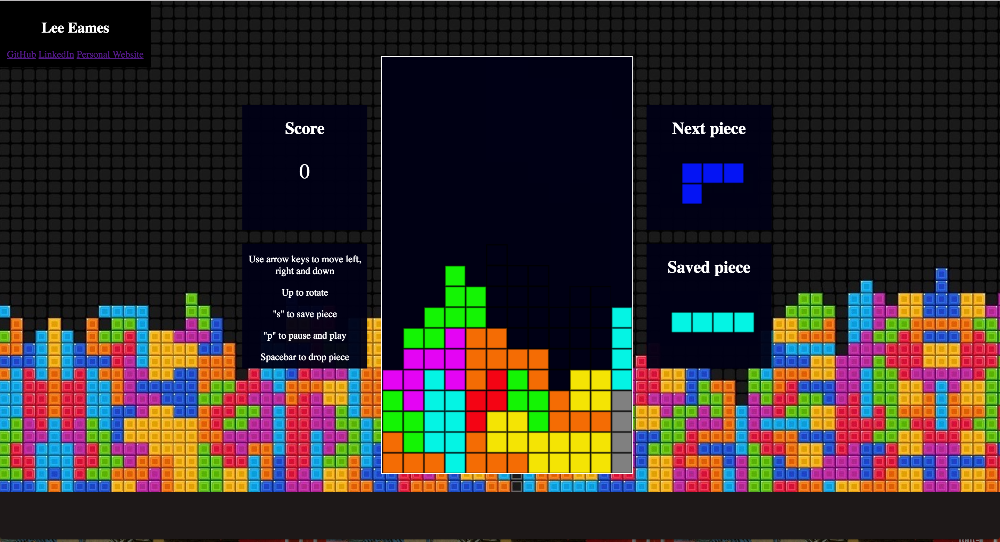

# Tetris

## Overview

Tetris is a a browser version of the classic tile-matching, puzzle video game, built using vanilla Javascript and HTML5 Canvas.

[Live version]: (https://www.lceames.github.io/Tetris)

## Features

- [ ] Pause/Play game toggling
- [ ] Save piece
- [ ] Next piece preview
- [ ] Falling Piece shadow
- [ ] Drop piece
- [ ] Slide fallen piece
- [ ] Levels with increasing speed

## Implementation Highlights

### Rotation

This application uses a transpose and reverse strategy to rotate pieces. It splices off a subsection of the game board's 2-dimensional grid into a square matrix, using the falling piece's rotation axis to ensure the piece is always centered. It then transposes the matrix and reverses each row to effectively render each piece. Rotation inputs are ignored when the rotation matrix includes any occupied positions or requires out-of-bounds coordinates.

### Shadowing

The shadow represents where the falling piece will land on its current downward trajectory. This feature was accomplished using an array of shadow coordinates. They are calculated, every time the falling piece's coordinates change, by incrementing along the y axis until they are touching another piece or a wall.

## Todos

- [ ] Leaderboard
- [ ] Counter-clockwise rotation
